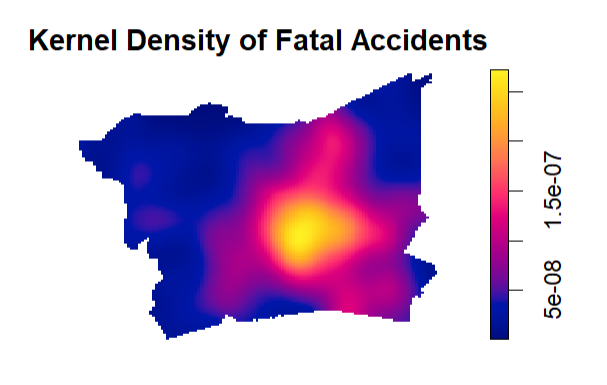
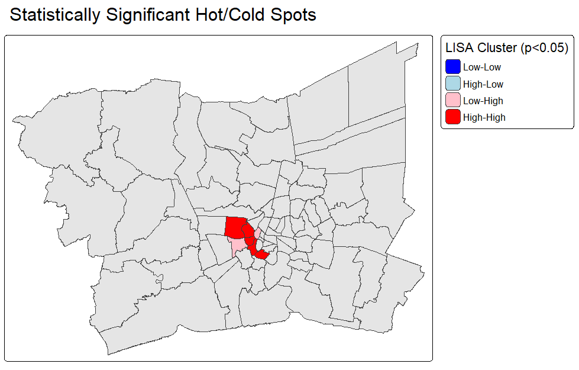
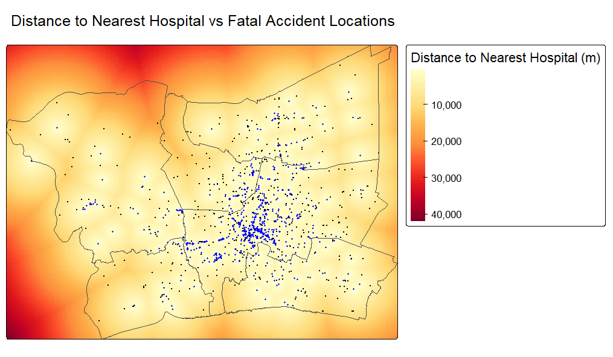
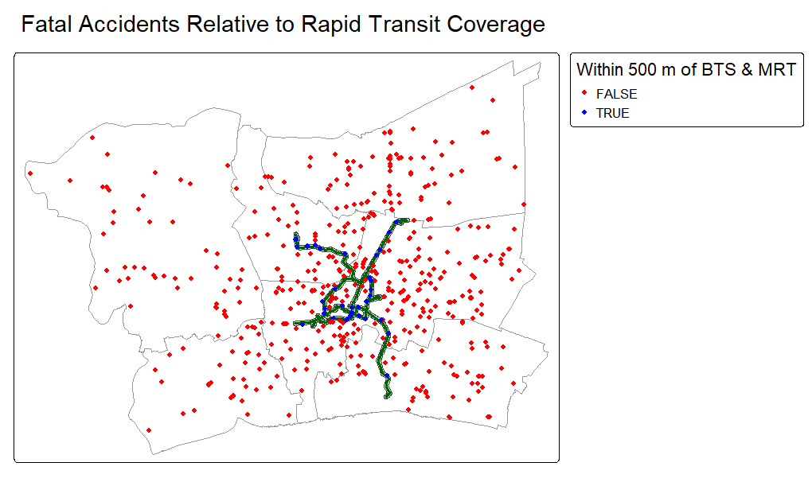

## Why Geospatial Analysis on Fatal Road Accidents?

::: incremental
- Fatal road accidents are rarely uniformly distributed. Aggregated national statistics make it hard to identify high risk clusters a.k.a. **hotspots**.

- Data analytics allows governments to implement location-specific interventions, backed by scientific evidence, to safeguard public road safety.
:::

## Why Bangkok Metropolitan Region? {.smaller}

- Thailand is ranked among the [10 highest road traffic fatality rates in the world](https://www.who.int/docs/default-source/documents/the-power-of-cities/bangkok-case-study-final.pdf?sfvrsn=790ce747_2) (WHO, 2019).

- Its densely-populated capital, Bangkok, experiences among the highest levels of traffic exposure and fatal road accidents in the country.

- The Bangkok Metropolitan Region (BMR) was used for the study area to avoid boundary/edge effects in spatial analysis and reflect the interconnected transport network that connects Bangkok and its surrounding provinces.

**Study Area**

**Bangkok Metropolitan Region (BMR)** — 1 metropolis, 5 surrounding provinces:

- Bangkok (metropolis)
- Nonthaburi
- Pathum Thani
- Samut Prakan
- Samut Sakhon
- Nakhon Pathom

79 districts across one metropolis and five provinces form the spatial unit for district-level analysis.

## Key Research Questions

1.  Where are the statistically significant hot spots for road fatalities?

2.  Which group of road users are the most vulnerable?

3.  Does proximity to hospitals reduce road accident fatality rates?

4.  Do areas served by the BTS & MRT network have lower fatality rates?

## Data Sources

| Dataset | Source |
|------------------------------------|------------------------------------|
| Administrative boundaries (ADM1/ADM2) | geoBoundaries |
| Road network | OpenStreetMap, via Geofabrik |
| Fatal road accident records (2024) | Kaggle — Thailand Road Fatalities dataset (Thai-language, AI-translated, spot-checked) |
| Health Facilities | The Humanitarian Data Exchange (HDX) |
| BTS Skytrain & MRT lines | OpenStreetMap, via `osmdata` (R package) |

*Full data management and wrangling is documented in the `.qmd` file.*

## Analytical Approach

::: incremental
- **Data preparation**: validate coordinates, detect and address duplicates, CRS transformation to EPSG:32647 (UTM Zone 47N), spatial and temporal filtering to BMR.

- **First-order Analysis**: Kernel Density Estimation with bandwidth sensitivity testing.

- **Second-order Analysis**: G-function vs. Complete Spatial Randomness (CSR); marked point pattern (Cross-K) by vehicle type.

- **District-level Spatial Autocorrelation**: Global and Local Moran's I on road-length-normalised accident rates.

- **Proximity analysis**: distance-to-nearest-hospital raster; transit catchment buffer comparison.
:::

## Key Findings {.smaller}

**Question 1 : Hot Spots**

- KDE reveals a **single dominant hotspot** in the central BMR, with density decreasing toward the periphery

- The G-function test confirms fatalities are **significantly clustered**, not randomly distributed (observed pattern consistently outside the CSR simulation envelope).

- Global Moran's I on road-length-normalised accident rates is significant (I = 0.206, p \< 0.001) — accident rates are spatially autocorrelated across districts

- Local Moran's I (LISA) identifies a **small but statistically significant High-High cluster core**, alongside a small Low-High outlier; most districts show no significant spatial association

**Question 2 : Vulnerable Road Users**

- **Motorcyclists account for the majority** of fatal accident victims.

- Motorcyclist victims skew **younger** than car-driver victims.

- Men outnumber women across nearly every road-user category (excluding pedestrians/cyclists, where sample size is small).

- The central hotspot from Question 1 is **driven primarily by motorcycle fatalities**.

- Cross-K analysis shows car and motorcycle fatalities are **spatially associated** at larger distances — the two groups share overlapping high-risk zones rather than occurring in segregated areas.

- No significant association between vehicle type and cause code once a single outlier pedestrian record is excluded.

## Key Findings {.smaller}

**Question 3 : Hospital Proximity**

- 56.6% of fatal accidents occurred within 2km of a hospital, versus only 17.1% of land area falling within that same distance band.

- Areas beyond 5km from a hospital account for just 14.9% of accidents, despite covering 60% of land area.

- **Hypothetical conclusion**: this pattern likely reflects that both hospital placement and accident risk are driven by the same underlying factors — population density and traffic exposure — rather than any direct relationship between hospital proximity and fatality risk itself.

**Question 4 : BTS & MRT Proximity**

- Most fatal accidents (486 of 530) occurred **outside** the 500m rapid transit buffer — but this reflects the buffer's small geographic footprint, not lower risk within it.

- Once normalised by area, the accident rate is actually **higher inside** the transit buffer (0.319 per km²) than outside it (0.065 per km²).

- **Hypothetical conclusion**: this again likely reflects population density and traffic exposure concentrated around transit nodes, rather than transit access itself increasing risk.

## Visual Evidence {.smaller}

::::: columns
::: {.column width="35%"}
KDE Hotspot Map

```{r,echo=FALSE, warning=FALSE, message=FALSE, out.width="120%"}

```
:::

::: {.column width="35%"}
LISA Significant Clusters Map

```{r,echo=FALSE, warning=FALSE, message=FALSE, out.width="120%"}

```
:::
:::::

::::: columns
::: {.column width="35%"}
Hospital Proximity Raster

```{r,echo=FALSE, warning=FALSE, message=FALSE, out.width="120%"}

```
:::

::: {.column width="35%"}
Transit Buffer Map

```{r,echo=FALSE, warning=FALSE, message=FALSE,out.width="120%"}

```
:::
:::::

## Data Quality

- Source data was in Thai language and translated using an AI tool, resulting in some data integrity loss, which was mitigated with manual spot-checking for accuracy.

- Latitude/longitude columns in the original translated file were found to be swapped and were corrected based on known coordinate ranges for Thailand.

- 16 duplicate records (with identical coordinates, death date, age, sex, cause code) were identified and removed as likely data entry errors.

- A significant number of records with missing coordinates were excluded (9516 nationally, of which 957 fell within the BMR, out of a total 1487 BMR records), reflecting poor data quality.

- Genuine distinct fatalities sharing the same exact coordinates were **jittered** so that each contributes separately to the Kernel Density Estimation (KDE) surface instead of merging into a single point or creating a false density spike at the specific coordinate.

## Conclusion

- **Location-Specific Resource Allocation**: Statistically significant High-High cluster districts identified should be prioritised for road safety infrastructure review and increased traffic police enforcement.

- **Motorcyclist-Focused Interventions**: Targeted measures such as increased rider education, stringent license requirements, or physical infrastructure improvements such as motorcycle-only dedicated lanes can be implemented in tandem for this user group.

- **Suggested Next Steps**: Incorporating reliable population density and traffic exposure data will help strengthen policy-making decisions based on geospatial analysis for Bangkok and other provinces with higher rates of fatal road accidents. An attempt to use OSM population density data sourced from The Humanitarian Data Exchange proved futile, which limited the analytical depth and reach of this study.
